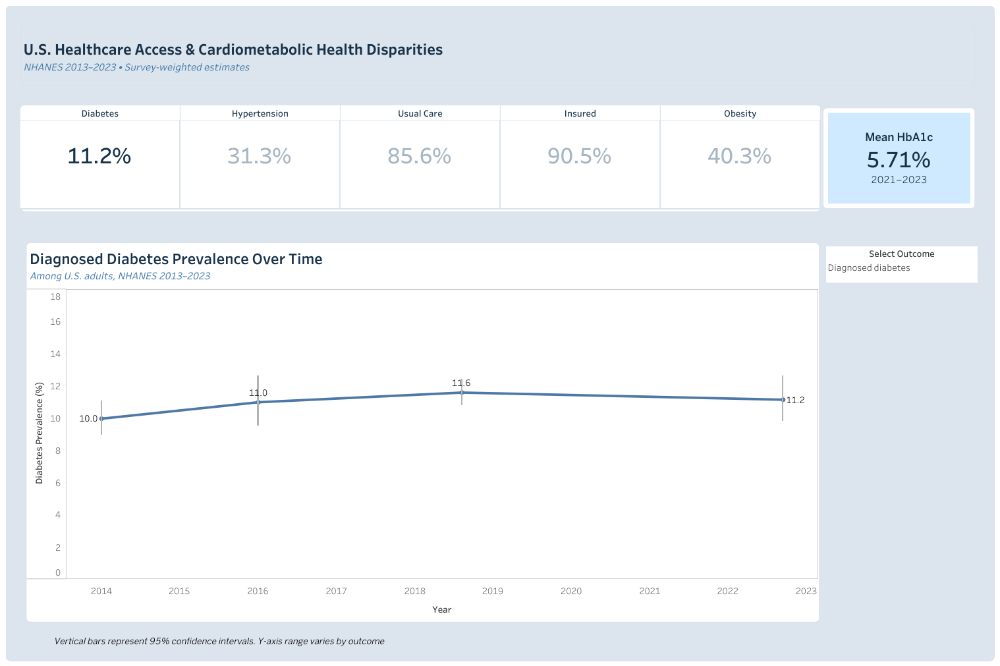
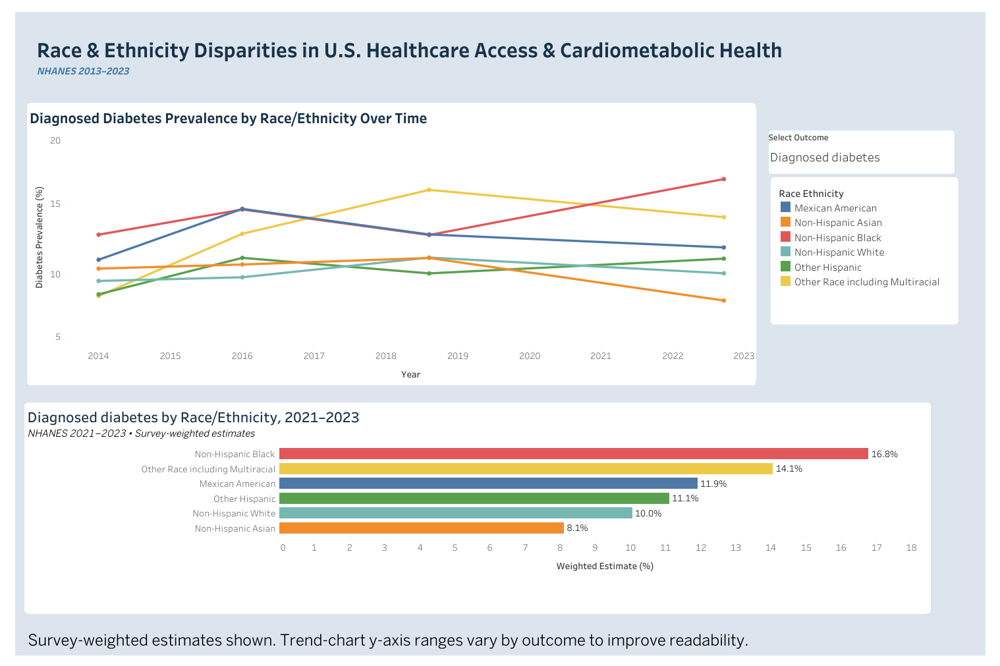
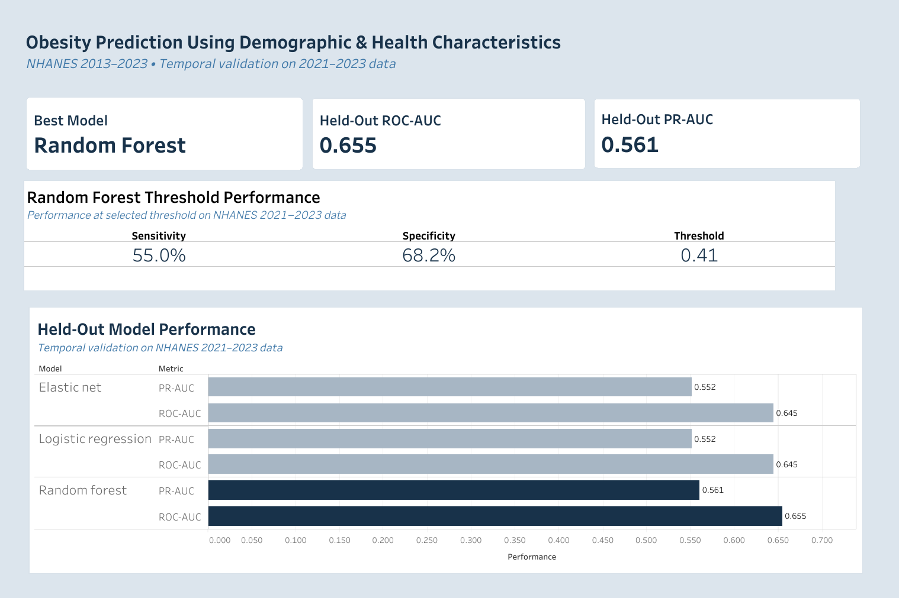
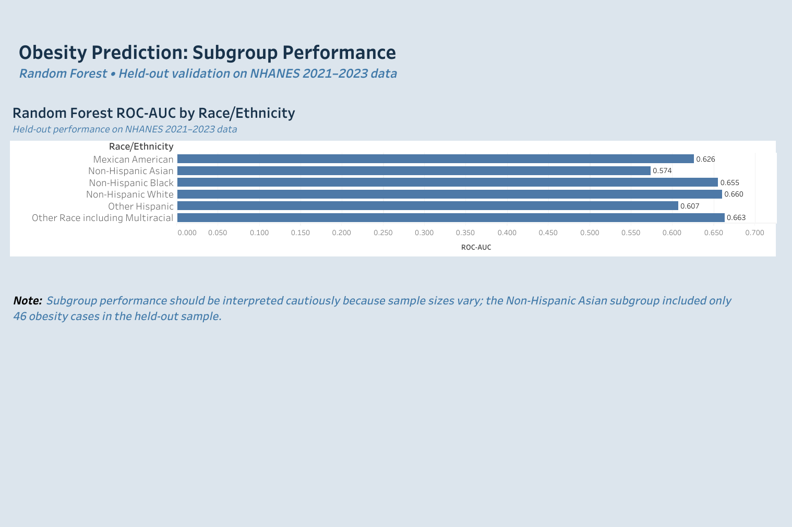

# U.S. Healthcare Access and Cardiometabolic Health Disparities, NHANES 2013–2023

An end-to-end health data analytics project using **SQL, PostgreSQL, R, machine learning, and Tableau** to examine trends and racial/ethnic disparities in healthcare access and cardiometabolic health among U.S. adults.

The project combines data engineering, complex survey analysis, regression modeling, machine learning, temporal validation, model evaluation, and interactive data visualization using multiple cycles of the National Health and Nutrition Examination Survey (NHANES).

## Project Objectives

This project addresses two related questions:

1. How have healthcare access and cardiometabolic health outcomes changed among U.S. adults from 2013–2023, and how do these patterns differ across racial/ethnic groups?
2. How well can demographic and health characteristics predict prevalent obesity, and does model performance vary across racial/ethnic subgroups?

## Tools & Technologies

- **SQL / PostgreSQL** — data integration, cleaning, validation, and creation of analysis-ready tables
- **R** — statistical analysis, complex survey methods, regression modeling, machine learning, and visualization
- **Machine Learning:** tidymodels, glmnet, ranger
- **Survey Analysis:** survey
- **Data Manipulation:** tidyverse
- **Tableau** — interactive dashboards and communication of analytical findings
- **Git / GitHub** — project organization and version control

## Data

Data were obtained from the **National Health and Nutrition Examination Survey (NHANES)** and combined across four analytical periods:

- 2013–2014
- 2015–2016
- 2017–March 2020 Pre-Pandemic
- August 2021–August 2023

A total of **28 NHANES source files** were integrated and validated, producing an analysis-ready dataset containing **47,639 participants**.

Primary variables included:

- Health insurance coverage
- Usual source of healthcare
- Obesity
- Diagnosed diabetes
- Diagnosed hypertension
- Hemoglobin A1c (HbA1c)
- Age
- Sex
- Race/ethnicity
- Education
- Poverty-income ratio

Analyses of health outcomes were restricted to adults aged 20 years and older as appropriate.

> Raw NHANES data files are not included in this repository. They are publicly available from the CDC/NCHS NHANES program.

## Analysis Workflow

### 1. Data Engineering

NHANES files were validated, imported, standardized, and combined using **R, SQL, and PostgreSQL**.

The workflow included:

- File and variable validation
- Data type and coding checks
- Participant-level merges
- Duplicate checks
- Derived variables
- Survey-cycle harmonization
- Creation of analysis-ready PostgreSQL tables
- Reproducible export of analytical datasets

### 2. Survey-Weighted Analysis

Complex survey methods were used to generate population-representative estimates while accounting for NHANES sampling weights, strata, and primary sampling units.

Analyses included:

- Survey-weighted prevalence estimates
- 95% confidence intervals
- Race/ethnicity-specific estimates
- Temporal trend analyses
- Multivariable regression
- Adjustment for demographic and socioeconomic characteristics
- Race/ethnicity × time interaction analyses

Outcomes included healthcare access, obesity, diabetes, hypertension, and HbA1c.

## Selected Population Health Findings

Across the study period:

- Health insurance coverage increased from approximately **81.9% to 90.5%**.
- Usual source of care remained relatively stable at approximately **84–86%**.
- Obesity prevalence increased from approximately **37.9% to 40.3%**.
- Mean HbA1c increased from approximately **5.62% to 5.71%**.
- Diagnosed hypertension prevalence declined from approximately **34.8% to 31.3%**.

Racial/ethnic differences remained evident across multiple healthcare access and cardiometabolic outcomes after covariate adjustment.

## Machine Learning Extension

A machine learning analysis was conducted to predict **prevalent obesity among U.S. adults**.

The modeling cohort included **25,016 adults**.

### Predictors

Predictors included:

- Age
- Sex
- Education
- Poverty-income ratio
- Health insurance status
- Usual source of care
- Diagnosed diabetes
- Diagnosed hypertension

BMI was excluded as a predictor because obesity was defined using BMI.

Race/ethnicity was **not included as a model predictor**. It was retained for subgroup performance evaluation.

### Models Compared

Three modeling approaches were evaluated:

- Logistic regression
- Elastic net
- Random forest

### Temporal Validation

Models were developed using NHANES data from:

**2013–March 2020**

and evaluated on a completely held-out temporal test set from:

**2021–2023**

This design assessed whether models maintained performance on participants observed during a later survey period.

## Model Performance

The random forest achieved the highest held-out performance among the evaluated models:

| Model | ROC-AUC | PR-AUC |
|---|---:|---:|
| Logistic Regression | 0.645 | 0.552 |
| Elastic Net | 0.645 | 0.552 |
| Random Forest | **0.655** | **0.561** |

Model evaluation included:

- ROC-AUC
- PR-AUC
- Accuracy
- Sensitivity
- Specificity
- Precision
- F1 score
- Brier score
- Calibration
- Classification-threshold evaluation
- Survey-weighted performance sensitivity analysis
- Race/ethnicity subgroup performance

A classification threshold of **0.41** was selected using training/CV data. On the held-out 2021–2023 sample, this threshold produced:

- Sensitivity: **55.0%**
- Specificity: **68.2%**

## Subgroup Model Performance

Random forest ROC-AUC in the held-out sample varied across racial/ethnic subgroups:

| Race/Ethnicity | ROC-AUC |
|---|---:|
| Mexican American | 0.626 |
| Non-Hispanic Asian | 0.574 |
| Non-Hispanic Black | 0.655 |
| Non-Hispanic White | 0.660 |
| Other Hispanic | 0.607 |
| Other Race including Multiracial | 0.663 |

Subgroup estimates should be interpreted cautiously because sample sizes differed substantially. In particular, the Non-Hispanic Asian subgroup included only **46 obesity cases** in the held-out test sample.

These subgroup analyses are intended as **model-performance audits**, not as evidence of biological or causal differences between racial/ethnic groups.

## Tableau Dashboards

Four dashboards were developed to communicate the epidemiologic and machine learning results.

### 1. Healthcare Access & Cardiometabolic Health Overview



Displays survey-weighted estimates and temporal trends for healthcare access and cardiometabolic outcomes.

### 2. Race & Ethnicity Disparities



Displays outcome trends and the most recent survey-weighted estimates across racial/ethnic groups.

### 3. Obesity Prediction — Model Performance



Summarizes model comparison, held-out ROC-AUC and PR-AUC, and random forest threshold performance.

### 4. Obesity Prediction — Subgroup Performance



Evaluates held-out random forest ROC-AUC across racial/ethnic subgroups.

## Interactive Tableau Dashboard

The interactive dashboards are also available through **Tableau Public**.

**Tableau Public link:** https://public.tableau.com/views/nhanes_health_disparities_dashboard/ObesityPredictionSubgroupPerformance?:language=en-US&:sid=&:redirect=auth&:display_count=n&:origin=viz_share_link 

## Repository Structure

```text
nhanes-health-disparities/
│
├── R/
│   ├── 01_validate_raw_files.R
│   ├── 02_load_raw_to_postgres.R
│   ├── 03_survey_analysis.R
│   └── 04_ml_extension.R
│
├── SQL/
│   └── SQL scripts for data preparation and analysis-ready tables
│
├── Tableau/
│   └── nhanes_health_disparities_dashboard.twbx
│
├── dashboard-images/
│   ├── overview_dashboard.png
│   ├── race_ethnicity_disparities_dashboard.png
│   ├── obesity_prediction_model_dashboard.png
│   └── obesity_prediction_subgroup_dashboard.png
│
└── README.md
```

## Key Project Skills Demonstrated

This project demonstrates an end-to-end health data analytics workflow including:

- Multi-file healthcare data integration
- SQL and relational database development
- Data quality validation
- Reproducible R programming
- Complex survey analysis
- Epidemiologic regression modeling
- Machine learning model development
- Temporal validation
- Model discrimination and calibration assessment
- Classification-threshold optimization
- Subgroup model-performance auditing
- Interactive Tableau dashboard development
- Translation of technical results for non-technical audiences

## Limitations

Several limitations should be considered:

- NHANES is observational and cross-sectional, so causal conclusions cannot be made.
- The 2017–March 2020 period combines approximately 3.2 years of data and differs in duration from the other analytical periods.
- NHANES data collection was interrupted during the COVID-19 pandemic, creating a gap between March 2020 and August 2021.
- NHANES sampling procedures changed in the 2021–2023 cycle.
- Diagnosed diabetes and hypertension measures depend partly on self-reported prior diagnosis.
- The machine learning analysis predicts **prevalent obesity**, not future obesity risk.
- Predictive associations and variable importance should not be interpreted as causal effects.
- Subgroup model-performance estimates may be unstable for groups with smaller sample sizes.

## Author

**Vani Balla**  
MPH Epidemiology Candidate  
University of Pittsburgh School of Public Health
